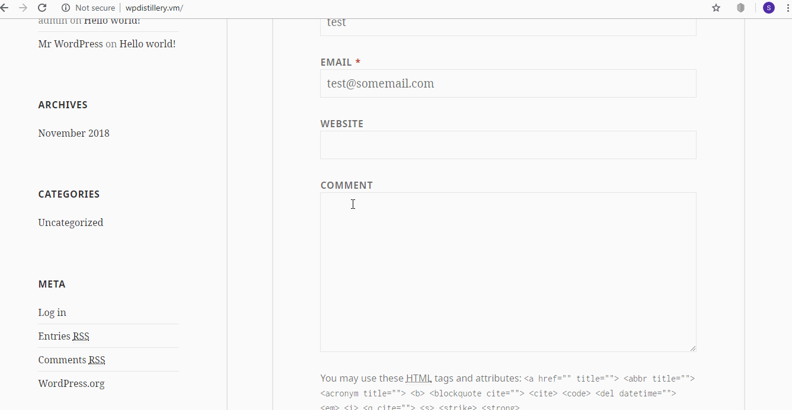
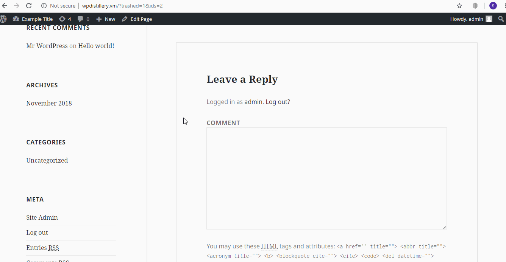
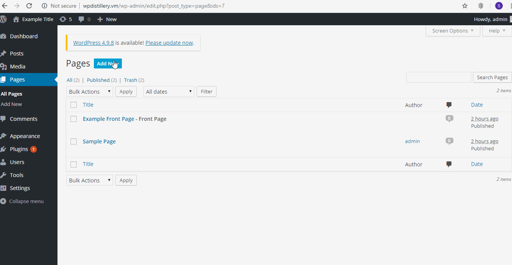

# WebSecurity Project Week 7- WordPress Pestering

Time Spend: 5.5 hours in total

> Objective: Find, analyze, recreate, and document **At least three (Up to 5) vulnerabilities** affecting an old version of WordPress

## Pentesting Report

1. (Required) XSS Vulnerability in 4.2 comments 
  - [ ] Summary: A Cross-Site Scripting vulnerability is found in WordPress Ver 4.2 when writing a comment 
    - Vulnerability type: XSS
    - Tested in version: 4.2
    - Fixed in version: 4.2.1
  - [ ] GIF Walkthrough:
  
  - [ ] Steps to recreate:
    1. Write a comment in wordpress by first writting "<a title='x onmouseover=alert(unescape(/hello%20world/.source)) style=position:absolute;left:0;top:0;width:5000px;height:5000px" without quotes.
    2. Then after that add on to the comment until the size of the comment is greater than 64kb.
    3. After the comment is completed, post it and login to your admin account.
    4. Once in the admin account open the comment section and approve the comment.
    5. After that is done click on view post on the comment page and if everything worked a window saying hello world should appear.
  - [ ] Affected source code:
    - [Link 1](https://core.trac.wordpress.org/browser/tags/4.2/src/wp-comments-post.php)
2. (Required) XSS Vulnerability in 4.2 (When Replying as adminstrator)
  - [ ] Summary: Can write Javascript code inside a link like yourlink.com/wp-admin/customize.php?theme=
    - Vulnerability types:XSS
    - Tested in version: 4.2
    - Fixed in version: 4.2.6
  - [ ] GIF Walkthrough: 
  
  - [ ] Steps to recreate:
  1. Login as an administrator.
  2. Reply to a post with a reply like http://www.example.com/wp-admin/customize.php?theme=<svg onload=alert('XSS')>  
  3. View post to see message.
  - [ ] Affected source code:
    - [Link 2](https://core.trac.wordpress.org/browser/tags/4.2/src/wp-admin/customize.php)
3. (Required) XSS vurnerability in the title page of creating a page
  - [ ] Summary: Can write Javascript code in title of creating a page
    - Vulnerability types:XSS
    - Tested in version: 4.2
    - Fixed in version: 4.2.4
  - [ ] GIF Walkthrough: 
   
  - [ ] Steps to recreate: 
  1. Go to create a page.
  2. At the title page write  <a onmouseover=alert('XSS')> (Whatever title you like)
  3. Then go to view page and you will see the an alert message when mouse hovers over page.
  - [ ] Affected source code:
    - [Link 3](https://core.trac.wordpress.org/browser/branches/4.2/src/wp-admin/js/nav-menu.js)

## Resources

- [WordPress Source Browser](https://core.trac.wordpress.org/browser/)
- [WordPress Developer Reference](https://developer.wordpress.org/reference/)

GIFs created with [LiceCap](http://www.cockos.com/licecap/).
wpscan on Kali Linux

## Notes

The biggest challegenge with this assignment to me was setting up the software (Vagrant, Kali VM). It took a while for me to get confortable with the equipment. Something interesting to note with the first vulnerability is that it was hit and miss for me. It took me a while to manipulate the size of the comment to get it to work. As a result I had to edit the comment several times until it was the right size (Over 64 kb). The WPSCAN tool and its sources such as https://wpvulndb.com/vulnerabilities/ proved to be very helpful in finding the vulnerabilities. 

## License

    Copyright [2018] [Sebastian Henriquez]

    Licensed under the Apache License, Version 2.0 (the "License");
    you may not use this file except in compliance with the License.
    You may obtain a copy of the License at

        http://www.apache.org/licenses/LICENSE-2.0

    Unless required by applicable law or agreed to in writing, software
    distributed under the License is distributed on an "AS IS" BASIS,
    WITHOUT WARRANTIES OR CONDITIONS OF ANY KIND, either express or implied.
    See the License for the specific language governing permissions and
    limitations under the License.
